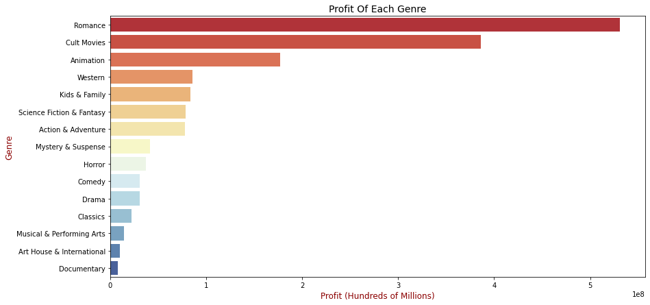
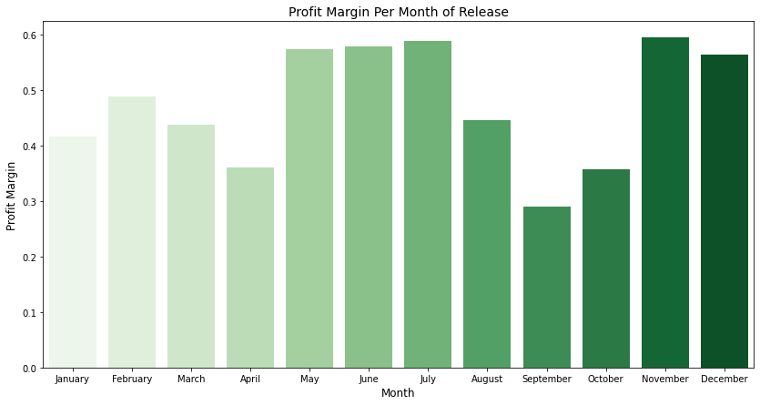

# A Movie Production Analysis for Microsoft

**Authors**: Sameeha Ramadhan


## Overview

This analysis attempts to satisfy the informational needs of Microsoft (MSFT) by investigating the film industry to determine which types of films their new studio should produce. We will look at a number of factors to better understand what contributes to the success of a movie, and in turn offer a few recommendations on the best strategies to get started. Microsoft can use this analysis to adjust planning, production, and marketing to hit the ground running as they enter this highly competitve space.

## Business Problem

Microsoft may be able to enter the movie making sector while successfully standing out from fierce competition by choosing to create films that their target audiences have shown to thoroughly enjoy. Doing so will allow them to produce movies that will instantly become hits, which will in turn allow them to improve on and produce even more content, setting them up to be a studio force to be reckoned with. Using data from well-known industry sources such as Imdb, I analyze and explain patterns in popular movie types based on ratings and reviews, as well as budgeting decisions to help predict what audiences want from a film and thus, guaranteeing its success.

## Data

Rotten Tomatoes is a well-known review-aggregation website for television and film and is widely viewed as the 'go-to' in deciding whether or not a production is worth watching. IMDB.com is a database that is considered to be the most authoritative source for all film and television related material. The data from both websites provides information such as, but not limited to, budgets, reviews and ratings.


## Methods

This project uses descriptive analysis, including description of movie trends based on the months in a year. This provides a useful overview of the movie industries' profits and profit margins based on release timings.


## Results

The top 3 most profitable movie genres are Romance, Cult Movies, and Animation, with Romance offering an average of .8 net profit.

### Visual 1


The best times to release a movie is during the early summer months (June and July), with July taking the number one spot in profit margins, followed by the holiday season, specifically November and December.

### Visual 2



## Conclusions

This analysis offers three conclusions to contribute to Microsoft's success as it enters the movie making industry:

1- **Microsoft should aim to budget around $96,194,000 to produce a film.** that should result in a profit margin of around **80\%**.

2- **The new studio should aim to release their movies between June and July, as well as over the winter holiday break.** Given that most children and their parents have breaks from school and work during these times, productions see a general increase in profitability.

3- **Microsoft should focus their efforts on the top 6 most profitable movie genres: Romance, Cult, Animation, Western, Kids & Family, and Sci-Fi.** Given the fact that a number of these genres, such as Animation and Kids & Family, aren't produced as frequently as others but nonetheless have impressive profit margins,  I'd recommend that Microsoft particularly consider these genres to potentially increase their profits greatly without much competiton when entering the movie making industry.


## For More Information

Please review our full analysis in [our Jupyter Notebook](./Microsoft-Movie-Analysis.ipynb) or our [presentation](./Microsoft-Movie-Analysis.pdf).

For any additional questions, please contact **Sameeha Ramadhan at shramadhan@gmail.com**

## Repository Structure

Describe the structure of your repository and its contents, for example:

```
├── README.md                           <- The top-level README for reviewers of this project
├── Microsoft-Movie-Analysis.ipynb      <- Narrative documentation of analysis in Jupyter notebook
├── Microsoft-Movie-Presentation.pdf    <- PDF version of project presentation
├── data                                <- Both sourced externally and generated from code
└── images                              <- Both sourced externally and generated from code
```
